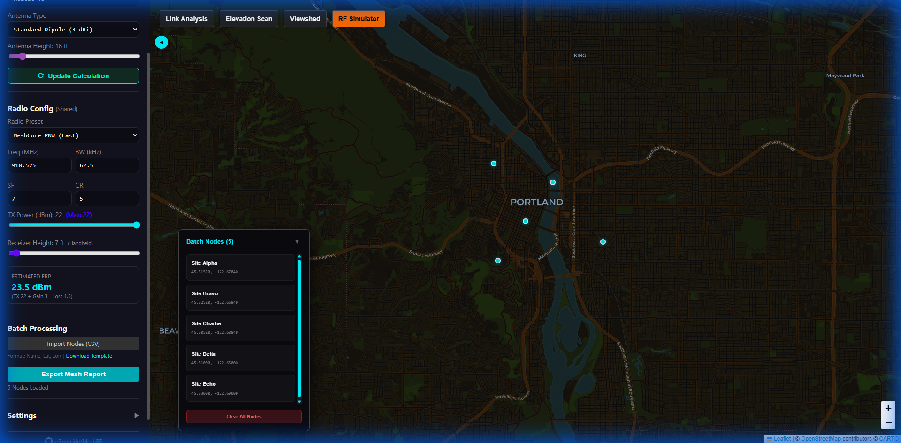

# Batch Processing

The **Batch Processing** tool allows users to analyze multiple sites and links simultaneously by importing a list of coordinates. It is ideal for planning large-scale mesh networks or evaluating many potential "Ideal Spots" at once.

## Batch Processing UI

## 1. Importing Nodes

You can import nodes via a CSV file. The tool supports a simple format: `Name, Latitude, Longitude`.

### CSV Format Requirements

The first line can be a header or data. The tool uses a heuristic to identify columns:

- **Format A**: `Site Name, Latitude, Longitude`
- **Format B**: `Latitude, Longitude, Site Name`

> [!TIP]
> Use the **"Download Template"** link in the sidebar to get a perfectly formatted CSV file.

## 2. Integration with Link Analyzer

The Batch Nodes panel provides a seamless transition into detailed point-to-point analysis:

- **TX Button**: Sets the selected node as the "Source" (Station A) in the Link Analyzer.
- **RX Button**: Sets the selected node as the "Target" (Station B) in the Link Analyzer.

By using these buttons, you can quickly verify a link's profile and Fresnel clearance for any node in your batch list without manual map placement.

> [!IMPORTANT]
> Selecting a different tool from the toolbar (e.g., switching from Link Analysis to Viewshed) will clear the current analysis markers and results from the map. However, your **Batch Nodes** will remain visible until you click **"Clear All Nodes"**.

## 3. Exporting Mesh Reports

The most powerful feature of Batch Processing is the **"Export Mesh Report"** button.

### What it does:

1. It iterates through every possible pair of nodes in your imported list.
2. It performs a terrain profile analysis for every link (Source to Target).
3. It calculates the Link Budget based on your current **Hardware Settings**.
4. It generates a CSV report containing:
   - **Distance**: In kilometers.
   - **Status**: GOOD, MARGINAL, or OBSTRUCTED.
   - **Clearance**: Minimum Fresnel zone clearance in meters.
   - **Margin**: Signal margin in dB.

> [!WARNING]
> Processing many links (e.g., 20+ nodes result in 190+ links) can take several minutes as the tool fetches terrain data for each path.

## Workflow Example

1. **Import** a list of existing nodes and potential new sites.
2. **Visualize** the nodes on the map to see geographic distribution.
3. **Select** a potential site as RX and an existing node as TX to check a specific link.
4. **Export** the full report to identify which new sites have the best connectivity to the existing mesh.
