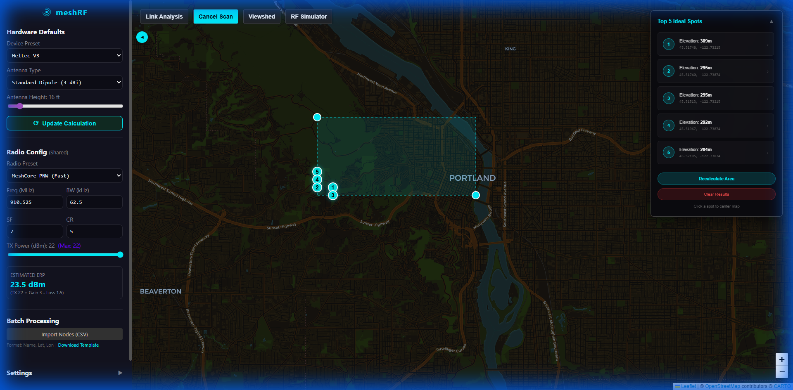

# Elevation Scan

The **Elevation Scan** tool is a rapid optimization engine designed to find the highest ground or best potential transmitter spots within a bounding area.

## Features

- **Dynamic Bounding Box**: Select any area on the map to scan.
- **Top 5 Ranking**: Automatically identifies and ranks the best 5 locations based on elevation and prominence.
- **Quick Deployment**: Click result markers to quickly evaluate them with other tools.

## How to Use

1. Select **Elevation Scan** from the toolbar.
2. Click two opposite corners on the map to define the scan area.
3. Review the ranked "Ideal Spot" markers (#1 to #5).
4. View the **Optimization Results Panel** for specific scores and coordinates.

### User Interface

## Use Cases

- **Site Selection**: Finding the best hill or rooftop for a master node.
- **Network Gap Filling**: Identifying high ground in "shadowed" areas of your network.

> [!TIP]
> Drag the corner handles of the bounding box to refine your search area in real-time.

> [!NOTE]  
> **Tool Switching**: Selecting a different tool will clear the current scan results and optimization markers.
