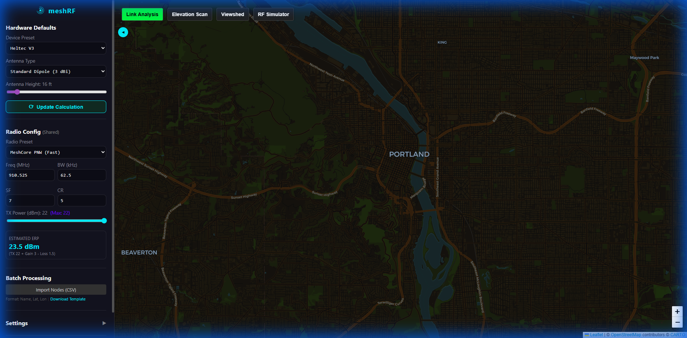

# Hardware Settings

MeshRF allows you to configure specific hardware parameters to accurately simulate real-world radio performance. These settings are located in the **Sidebar** under "Hardware Defaults" (global) or "Node Hardware" (node-specific).

## Hardware Configuration UI

## 1. Device Presets

Selecting a device preset automatically configures the **Max TX Power** and **Internal Cable Loss**.

| Device                      | Max TX Power | Default Loss |
| --------------------------- | ------------ | ------------ |
| **Heltec V3**               | 22 dBm       | 1.5 dB       |
| **Heltec V4 (High Power)**  | 28 dBm       | 1.5 dB       |
| **Seeed Studio Xiao**       | 22 dBm       | 2.0 dB       |
| **RAK WisBlock 4631**       | 22 dBm       | 0.5 dB       |
| **Station G2 (High Power)** | 37 dBm (5W)  | 0.5 dB       |

## 2. Antenna Types

The antenna type determines the gain (dBi) added to your signal.

- **Stubby (2.15 dBi)**: Standard small antenna included with most modules.
- **Standard Dipole (3.0 dBi)**: Common half-wave dipole.
- **Fiberglass Omni (5.8 - 8.0 dBi)**: High-gain base station antennas for broad coverage.
- **Yagi (11.0 dBi)**: Directional antenna for long-range point-to-point links.
- **Custom**: Manually enter any gain value.

## 3. Radio Configuration (LoRa)

For the **RF Simulator** and **Link Analyzer**, these parameters define the signal's robustnes:

- **Frequency (MHz)**: Higher frequencies (e.g., 915MHz) suffer more path loss than lower ones (e.g., 433MHz).
- **Bandwidth (BW)**: Narrower bandwidths increase sensitivity but decrease data rate.
- **Spreading Factor (SF)**: Higher SF (e.g., SF12) provides much longer range at the cost of airtime and speed.
- **Coding Rate (CR)**: Adjusts the error correction overhead.

## How it Impacts Tools

### RSSI & Link Margin

`RSSI = TX_Power + TX_Gain - Path_Loss - TX_Loss + RX_Gain - RX_Loss`

Higher antenna gain or lower cable loss directly improves your **Link Margin**, allowing the **Link Analyzer** to show a "Green" status over longer distances.

### Coverage

Increasing **TX Power** or **Antenna Height** in the hardware settings will expand the coverage heatmap in the **RF Simulator** and visibility in the **Viewshed**.
