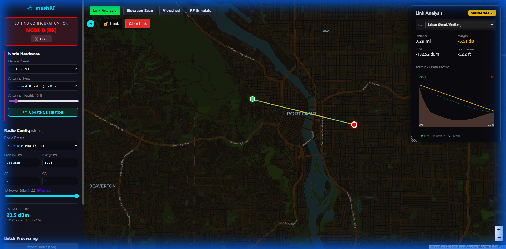

# Link Analyzer

The **Link Analyzer** is designed for detailed point-to-point analysis between two nodes. It evaluates the physical feasibility of a wireless link by considering terrain profiles, Fresnel zone clearance, and signal loss models.

## Features

- **Profile Verification**: Real-time terrain profile between Site A and Site B.
- **Fresnel Zone Analysis**: Visualizes the first Fresnel zone and calculates minimum clearance.
- **Link Budget Calculation**: Predicts RSSI and link margin based on hardware and environment settings.
- **Propagation Models**: Choose between Free Space Path Loss (Ideal) and Okumura-Hata (Realistic).

## How to Use

1. Click the **Link Analysis** button in the toolbar.
2. Click anywhere on the map to set **Node A**.
3. Click another point to set **Node B**.
4. Review the **Link Analysis Panel** for stats and the terrain profile chart.

### User Interface

## Parameters

| Parameter          | Impact                                                               |
| ------------------ | -------------------------------------------------------------------- |
| **Antenna Height** | Increases clearance and reduces path loss.                           |
| **Frequency**      | Higher frequencies have higher path loss and smaller Fresnel zones.  |
| **Environment**    | Urban vs. Rural affects the path loss calculation in Realistic mode. |

> [!TIP]
> Use the **Lock** button to freeze a link and adjust transmitter parameters without losing your placement.

> [!NOTE]  
> **Tool Switching**: Selecting a different tool (e.g., Viewshed) will clear your current Link Analysis markers and results.
