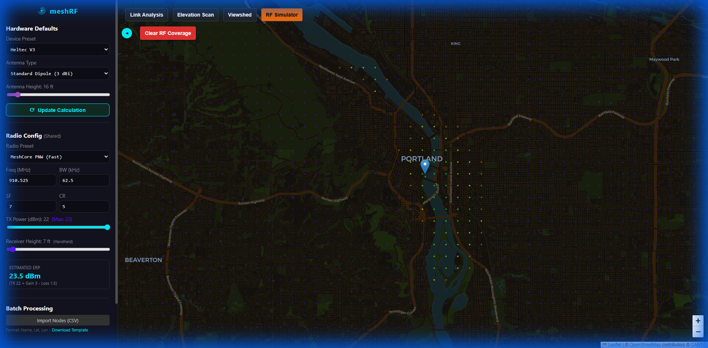

# RF Simulator

The **RF Simulator** provides a radio propagation heatmap from a transmitter. Unlike the optical Viewshed, it accounts for frequency-specific attenuation and signal quality metrics.

## Features

- **SNR Heatmap**: Color-coded visualization of signal quality (SNR) across the area.
- **Threshold Awareness**: Fades out signals that fall below the configured receiver sensitivity.
- **Multi-Parameter Support**: Factors in Frequency, TX Power, Antenna Gain, and Spreading Factor.

## How to Use

1. Select **RF Simulator** from the toolbar.
2. Click on the map to place your **Transmitter**.
3. Review the color-coded dots representing signal strength in the area.

### User Interface

## Signal Quality Legend

| Color           | Quality   | Description            |
| --------------- | --------- | ---------------------- |
| **Dark Green**  | Excellent | > 10dB Margin          |
| **Soft Green**  | Good      | 5-10dB Margin          |
| **Yellow**      | Fair      | 0-5dB Margin           |
| **Orange**      | Marginal  | Near Sensitivity Floor |
| **Purple/Fade** | Poor      | Below Reliable Limit   |

> [!IMPORTANT]
> Ensure your **Frequency** and **Bandwidth** settings match your hardware for the most accurate simulation.

> [!NOTE]  
> **Tool Switching**: Selecting a different tool will clear the current RF heatmap from the map.
