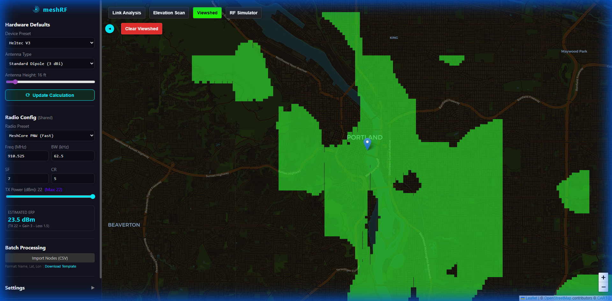

# Viewshed Tool

The **Viewshed Tool** performs an optical Line-of-Sight (LoS) analysis from a single observer point. It identifies all areas visible from the observer's location, considering only terrain obstructions.

## Features

- **Optical Coverage**: Visualizes what a camera or human observer would see.
- **25km Range**: Analyzes a large radius around the observer point.
- **Stitched Terrain**: Uses a high-resolution seamless mesh for precise results.

## How to Use

1. Select **Viewshed** from the toolbar.
2. Click on the map to place the **Observer**.
3. The map will display **Green** for visible areas and **Purple** for obstructed terrain.

### User Interface

## Parameters

| Parameter           | Impact                                                           |
| ------------------- | ---------------------------------------------------------------- |
| **Observer Height** | Higher placement increases visible area.                         |
| **Visualization**   | **Green** = Line-of-Sight, **Purple** = Obstructed (Shadow Mode) |
| **Max Distance**    | Constrains the radius of the analysis for performance.           |

> [!NOTE]
> Viewshed only accounts for terrain. For radio-specific coverage that includes signal attenuation and noise, use the **RF Simulator**.

> [!NOTE]  
> **Tool Switching**: Selecting a different tool will clear your current Viewshed coverage from the map.
