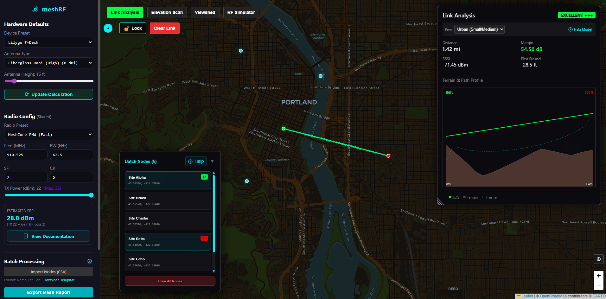

# meshRF 📡 v1.9.0

A professional-grade RF propagation and link analysis tool designed for LoRa Mesh networks (Meshtastic, Reticulum, Sidewinder). Built with **React**, **Leaflet**, and a high-fidelity **Python Geodetic Physics Engine**.

meshRF is designed for **mission-critical availability**. It operates with **zero external API dependencies** for elevation data, serving high-resolution terrain data directly from self-hosted containers. Currently we do rely on exteranl API's for map tiles but that will be updated soon as well for full offline use. (optional)



## ✨ Core Pillars

### 1. 📡 High-Fidelity RF Analysis

- **Server-Side Physics**: All calculations now run on a dedicated Python backend using **NumPy** and **SciPy** for maximum accuracy.
- **Advanced Models**:
  - **ITM (Longley-Rice)**: The gold standard for irregular terrain modeling (via Bullington Diffraction).
  - **Okumura-Hata**: Ported to backend for consistent statistical urban modeling.
  - **Free Space**: Optimistic baseline comparison.
- **Asymmetric Links**: Configure unique hardware (power, gain, height) for Node A and Node B independently.
- **Dynamic Fresnel visualization**: Real-time 2D profiles showing LOS and Fresnel zone clearance using backend-generated geometry.

### 2. 📍 Advanced Site Surveying

- **Parallel Location Optimization**: Rapidly scan bounding boxes for optimal node placement using high-concurrency grid searches.
- **RF Coverage Simulator** (In Test): Optimized Wasm-powered ITM propagation modeling for wide-area coverage visualization.
- **Viewshed Analysis**: Desktop-grade viewshed calculations with "Shadow Mode" visualization (Green/Purple) for precise LOS checking.
- **Geolocation**: "Locate Me" feature for instant map orientation during field surveys.

### 3. ⚡ Batch Operations & reporting

- **Bulk Link Matrix**: Import CSVs (`Name, Lat, Lon`) to instantly compute link budgets for entire networks.
- **Automated Reporting**: Export detailed CSV reports containing RSSI, Signal Margin, and Clearance values.
- **Context-Aware Guidance**: Every tool features built-in, interactive help banners that update based on your current mode, guiding you through workflows step-by-step.

### 4. 📚 Documentation

Detailed guides for specific tools:

- [📖 viewshed.md](./Documentation/viewshed.md) - Optical LOS analysis.
- [📖 rf-simulator.md](./Documentation/rf-simulator.md) - Coverage heatmap simulation.
- [📖 interactions.md](./Documentation/interactions.md) - Tool workflows and "Locate Me".
- [📖 batch-processing.md](./Documentation/batch-processing.md) - Bulk link analysis.
- [📖 hardware-settings.md](./Documentation/hardware-settings.md) - Node configuration.
- [📖 pwa-guide.md](./Documentation/pwa-guide.md) - Install on Desktop & Mobile.

### 5. 📱 Progressive Web App (PWA)

meshRF is fully installable on **Desktop (Chrome/Edge)** and **Mobile (iOS/Android)**.

- **Offline Shell**: Loads instantly even without a network connection.
- **Native Experience**: Runs in a standalone window without browser chrome.
- **Dark Mode**: Optimized startup with no white flashes.

---

## 📡 Propagation Models

meshRF supports multiple propagation models to suit different environments:

| Model                  | Best For          | Characteristics                                           |
| :--------------------- | :---------------- | :-------------------------------------------------------- |
| **Free Space (FSPL)**  | Ideal LOS, Orbit  | Baseline physics, no terrain or environment effects.      |
| **Okumura-Hata**       | Flat/Suburban     | Empirical model for urban/suburban. Assumes flat terrain. |
| **ITM (Longley-Rice)** | Irregular Terrain | **Recommended**. High-fidelity terrain-aware modeling.    |

> [!TIP]
> Use **ITM** for most terrestrial link analyses to account for hills and varying terrain heights. Use **Okumura-Hata** for quick city-wide surveys where buildings dominate over terrain.

---

## 🚀 Getting Started

### 🐳 Running with Docker (Recommended)

meshRF is fully containerized and easy to deploy:

1. **Clone and Run**:

   ```bash
   git clone https://github.com/d3mocide/meshrf.git
   cd meshrf
   docker compose up -d
   ```

2. **Access the App**:
   - Frontend: `http://localhost` (Port 80)
   - RF Engine API: `http://localhost:5001/docs` (Swagger UI)

3. **Elevation Data**:
   By default, meshRF uses a local **OpenTopoData** instance. You must download elevation files (HGT/TIF) to the `./data/opentopodata` directory.
   👉 **[See Setup Guide](./OPENTOPO_GUIDE.md)** for data download instructions.

### ⚙️ Configuration (Docker)

You can customize the application behavior by setting environment variables in `docker-compose.yml`:

| Variable            | Description                                                                                    | Default      |
| ------------------- | ---------------------------------------------------------------------------------------------- | ------------ |
| `DEFAULT_MAP_STYLE` | Initial map theme (options: `dark`, `light`, `dark_matter`, `dark_green`, `topo`, `satellite`) | `dark_green` |
| `DEFAULT_UNITS`     | Measurement system (`imperial` or `metric`)                                                    | `imperial`   |
| `VITE_MAP_LAT`      | Initial map center latitude                                                                    | `45.5152`    |
| `VITE_MAP_LNG`      | Initial map center longitude                                                                   | `-122.6784`  |

---

## 🏗️ Architecture

- **Frontend**: React + Leaflet + Vite.
- **RF Engine**: FastAPI Python service. Now the central **Physics Authority**, handling all propagation models (ITM, Hata, FSPL) and terrain profiling.
- **OpenTopoData**: Self-hosted elevation API providing geodetic data without external requests or rate limits.
- **Redis**: High-speed caching layer for terrain and analysis results.

## 📄 License

MIT License. Free to use and modify.

## ⚠️ Disclaimer

This tool is a simulation. Real-world RF propagation is affected by complex factors (interference, buildings, weather) not fully modeled here. Always verify with field testing.

**AI Disclosure**: Segments of this codebase were developed with the assistance of advanced AI coding agents. While all code has been reviewed and tested, users should exercise standard due diligence when deploying in critical environments.
